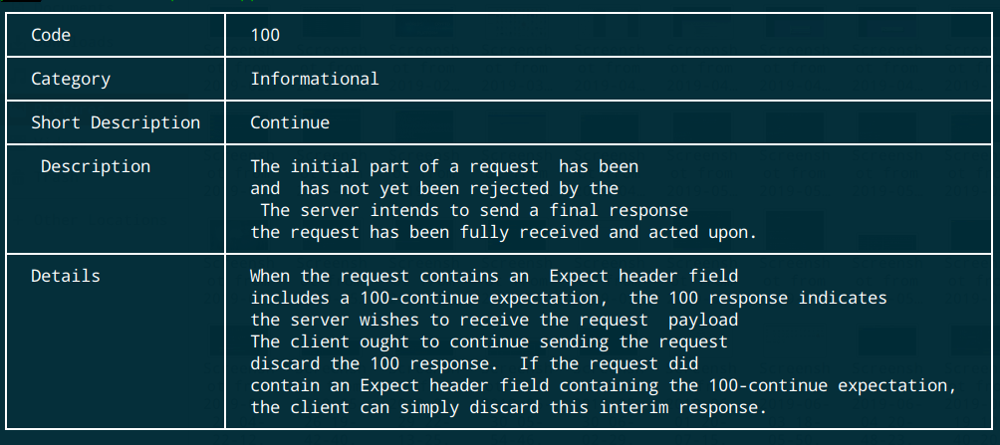

# HttpStatucpp

This is a simple command line utility that let you get the meaning of 
http status codes right in your terminal.

## Building and running

**NB:** If you don't want to build it yourself you can download prebuild binaries following this link
https://github.com/sdmg15/httpstatucpp/releases

 ### Requirements

* CMake (min 3.13)
* Clang or g++ 7.3.0
* Conan - C++ package manager

**NB :** This was tested only on Ubuntu 18.08 (Bionic)

### Building 

- Create the build directory and change to it : 
 
`mkdir build && cd $_ `

- Install the dependencies using conan :

`conan install .. `

- Build finaly :

`cmake --build ..`

The resulting binary could be found in the `bin` folder.

### Running 

You can alias the command and/or symlink it to be able to run it globally.

Here is an example on how to run the command : 

`~$ httpstatucpp code 100`

Sample result :

## Todo 
 - [x] code success -- display all success status codes
 
 - [x] code errors -- display all errors status codes
 
 - [x] code informational -- display all informational status codes
 
 - [x] code redirection -- display all redirection status codes 
 
 - [x] code serverError -- display all serverError status codes 
 
 - [x] Enhance displaying of the result
  
 - [ ] Export the resulted binary to /usr/local
 
 - [x] Display output screenshots
    
